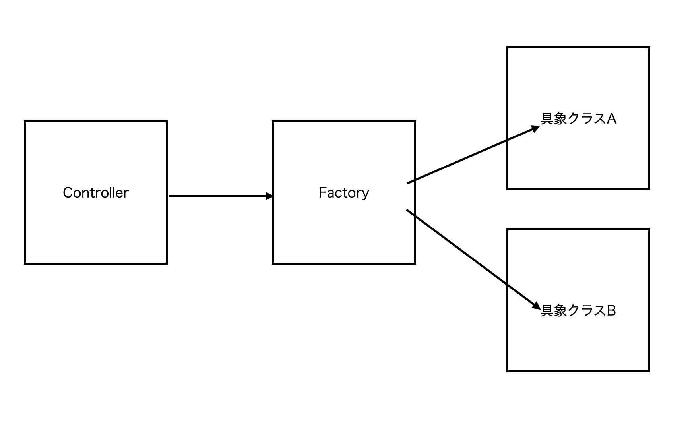

# クラスの同士の依存度を解消する方法
## どんな時にクラスの依存度が上がるのか
あるクラスの中で他のクラスをインスタンス化した際にクラス同士の依存度が上がる。

|  インスタンス化する場所  |  依存度  |
| ---- | ---- |
|  クラスのメソッド  |  高  |
|  クラスのコンストラクタ  |  中  |
|  メインルーチン  |  低  |
|  Factoryクラス  |  低  |

## 解決方法
Factoryクラスを使用する

上記の図のようにFactoryクラスを経由して具象クラスをインスタンス化する