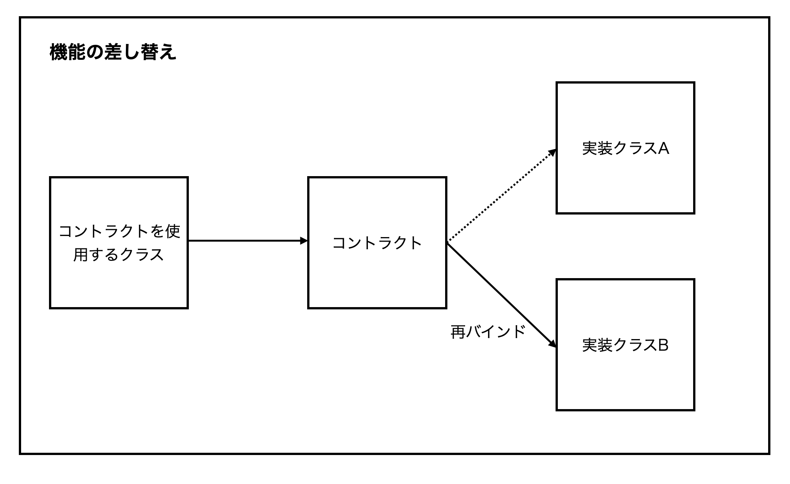

# コントラクトについて
## コントラクトとは
コントラクトはインターフェースで、Laravelのコアコンポーネントメソッドの定義をしている。

サービスコンテナへのバインドを再設定すればコントラクトの実装を差し替えることができる。

## 実装クラスを差し替え際のイメージ

コントラクトの実装は元々クラスAにあるが、クラスBを実装クラスとするようサービスコンテナへ再バインドすることにより、実装クラスを差し替えている。