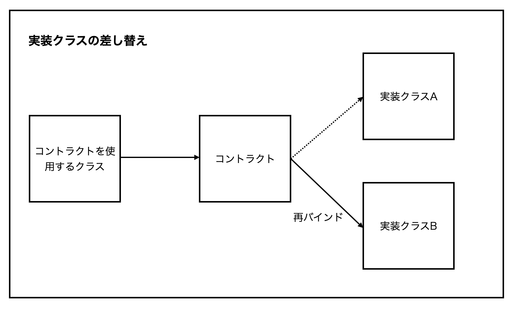

# コントラクトについて
## コントラクトとは
コントラクトはLaravelのコアコンポーネントメソッドの定義をしているインターフェース。

サービスコンテナへのバインドを再設定すればコントラクトの実装を差し替えることができる。

## 実装クラスを差し替える際のイメージ

コントラクトの実装は元々クラスAにあるが、クラスBを実装クラスとするようサービスコンテナへ再バインドすることにより、実装クラスを差し替えている。