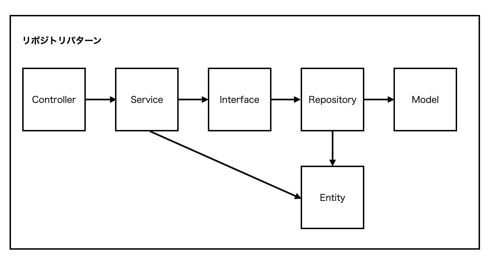

# リポジトリパターンついて
## リポジトリパターンとは
アプリの設計方法で、データストアを操作する処理をビジネスロジックから切り離すような設計手法。  
データストア先が変わった場合に修正する範囲が限定的になり、保守性が高まる。

## リポジトリパターンのイメージ図

### リクエストがあった際の流れ
1. コントローラーでサービスクラスを使用する
1. サービスクラスでインタフェースを経由してリポジトリを使用する
1. サービスクラスでエンティティを使用する
1. リポジトリからエンティティの使用とモデルを通してデータストアの操作を行う

### 各クラスの役割について
#### サービスクラス
ここにビジネスロジックを書く。  
エンティティの状態を更新したり、リポジトリを使用してデータの永続化を行う。
#### リポジトリクラス
データ取得、登録、更新、削除などデータストアの操作を行う。
#### エンティティクラス
データの状態を一時的に保つ。  
データの登録などを行う際はエンティティのデータを永続化する
  
※コントローラ、インターフェース、モデルは割愛
